## 'Hope' app

The app's idea is to help people to find short term job (part time job) quickly.

## UI/UX

## User stories

- Must have
  - Login: by email/ facebook
  - Post a job
  - List of categories
  - List of jobs in each category
  - Favorite/like a job
  - List of favorited jobs
  - Location based filtered jobs
  - List of posted jobs
  - List of done jobs
  - A job must include: description, location, working hours, salary range, male/female specific
  - Design UI/UX
  - Search Job
  - Search location
- Optional
  - Inbox feature, allow users to discuss before taking the job
  - Allow to share the job to social network: Facebook, Twitter, LinkedIn
  - Allow to configure the type of jobs which I would like to see more often, ex: I'm on interested in tutor jobs
  - Job seeker and posted job can be able to chat
  - Report Violation
  
## Survey 
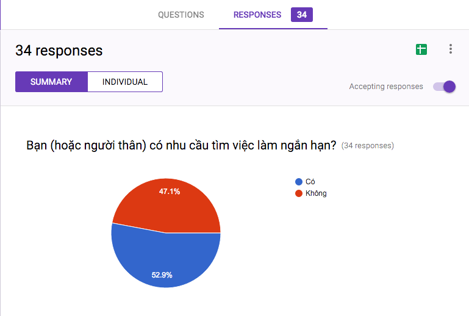
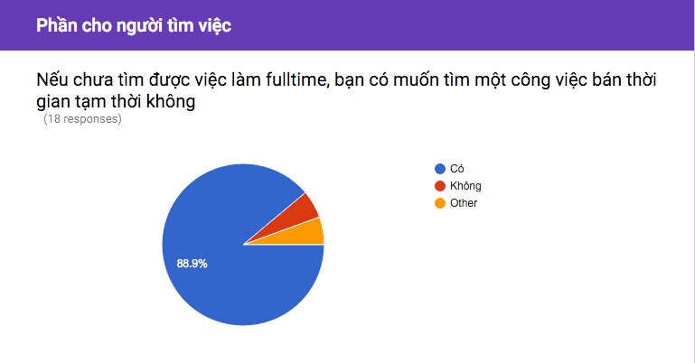
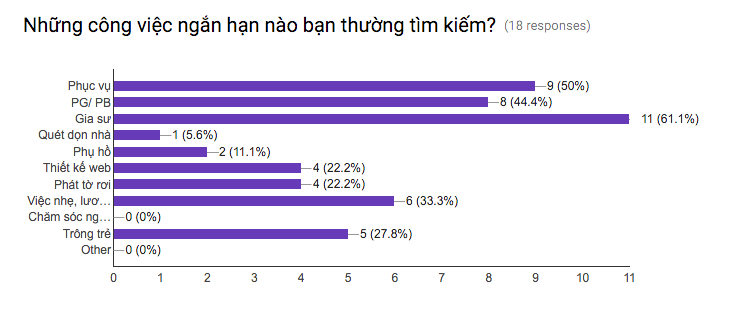
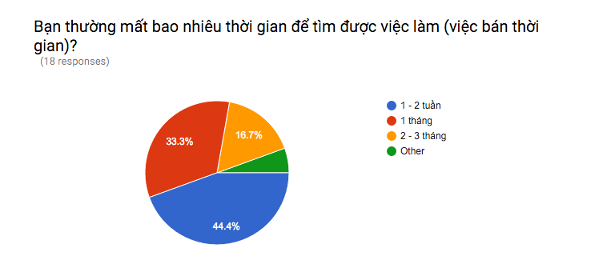
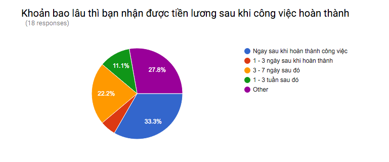
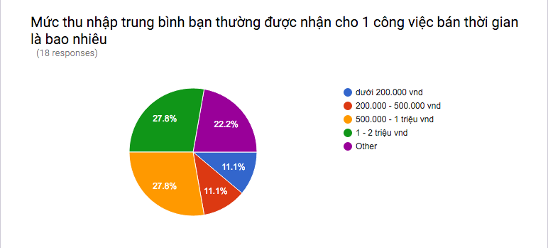
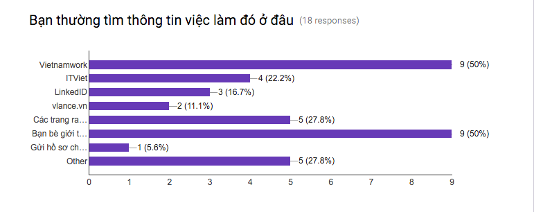
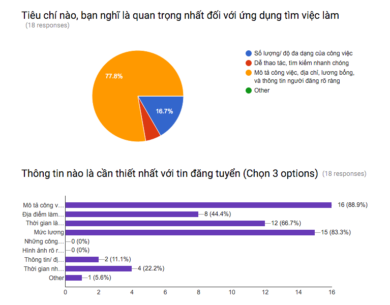
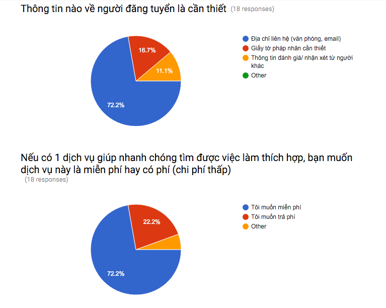
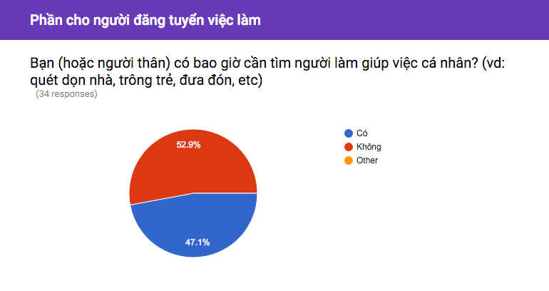
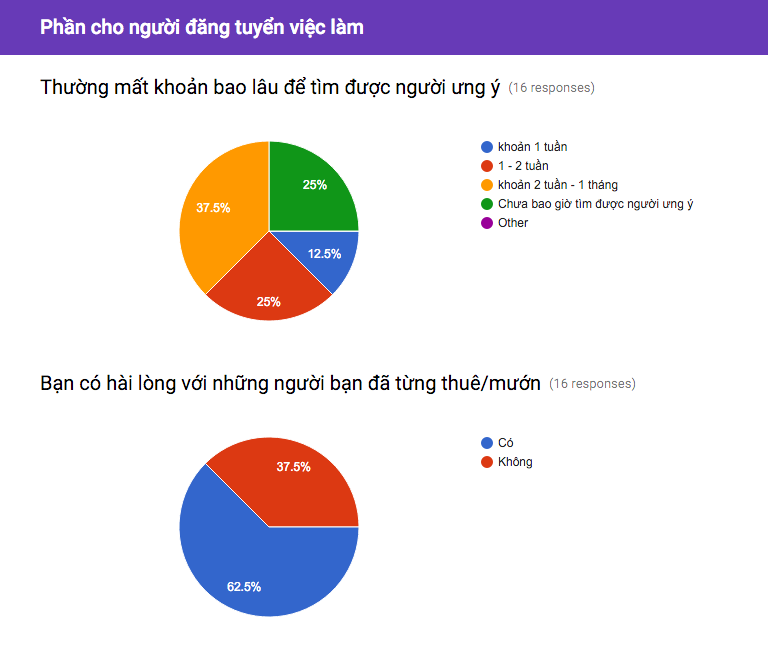

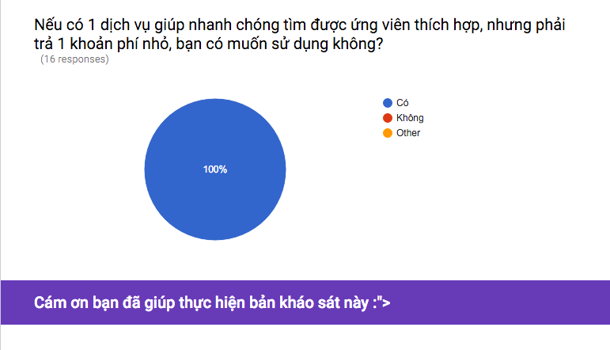
